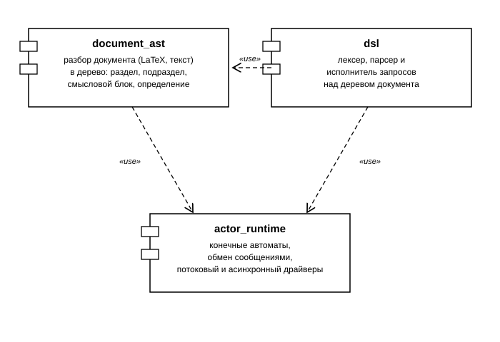

# Текущая грамматика и архитектура DiGr DSL

Актуальное состояние **после** объединения запросов (задача 3.1, см.
[`dsl_unification_report.pdf`](dsl_unification_report.pdf)). Более ранние
[`architecture_report.pdf`](architecture_report.pdf) и
[`grammar_report.pdf`](grammar_report.pdf)/[`original_dsl_grammar.rbnf`](original_dsl_grammar.rbnf)
описывают состояние **до** объединения (FIND/CONTEXT/DISTANCE как три
независимые продукции) и оставлены для истории.

## Архитектура

Система разделена на три связанные подсистемы с однонаправленными
зависимостями:

- **document_ast** — разбор произвольного документа (LaTeX, текст) в дерево
  сущностей: раздел, подраздел, смысловой блок, определение понятия.
- **dsl** — лексер, парсер и исполнитель запросов над этим деревом.
- **actor_runtime** — акторный рантайм, на котором построены обе подсистемы
  (конечные автоматы, обмен сообщениями, потоковый и асинхронный драйверы
  выполнения).

`document_ast` и `dsl` построены на `actor_runtime`; `dsl` дополнительно
использует `document_ast` для обхода дерева документа.

Общий процесс обработки: исходный файл → AST-документ → текст запроса →
разобранный запрос → результат в JSON.



## Грамматика (РБНФ)

Раньше грамматика представляла собой три независимые продукции: запрос
FIND, CONTEXT, DISTANCE. Сейчас — общий заголовок запроса по ключевому
слову + общий хвост запроса (`WITHIN* WHERE? LIMIT_PAIRS? RETURN?`).

Лексика: [`../engine/src/dsl/parsing/lexer.py`](../engine/src/dsl/parsing/lexer.py).
Синтаксис: [`../engine/src/dsl/parsing/recursive_descent_parser.py`](../engine/src/dsl/parsing/recursive_descent_parser.py).

Файл грамматики в РБНФ: [`../engine/dsl_grammar.rbnf`](../engine/dsl_grammar.rbnf).

```
/*
 * DiGr DSL - Грамматика (РБНФ)
 *
 * Лексика: src/dsl/parsing/lexer.py
 * Синтаксис: src/dsl/parsing/recursive_descent_parser.py
 *
 * Задача 3.1: <Запрос> ниже раньше был тремя отдельными продукциями
 * (<Запрос CONTEXT>/<Запрос FIND>/<Запрос DISTANCE>), теперь - общий
 * <Заголовок запроса> по ключевому слову + общий <Хвост запроса>
 * (WITHIN* WHERE? LIMIT_PAIRS? RETURN?). Раздел ЛЕКСИКА не менялся.
 */

/* --- ЛЕКСИКА --- */

<Ввод> ::= { <Лексема> | <Пробел> } <EOF> ;

<Пробел> ::= /* пробел, табуляция, переводы строк */ ;

<Лексема> ::= <Идентификатор>
            | <Ключевое слово>
            | <Число>
            | <Строка>
            | <Регулярное выражение>
            | <Оператор>
            | <Разделитель> ;

<Идентификатор> ::= <Буква> { <Буква> | <Цифра> | "_" } ;
<Буква> ::= /* [a-zA-Z] */ ;
<Цифра> ::= "0" | "1" | "2" | "3" | "4" | "5" | "6" | "7" | "8" | "9" ;

<Ключевое слово> ::= "CONTEXT" | "FIND" | "DISTANCE" | "FOR" | "TO" | "WITHIN"
                   | "LIMIT_PAIRS" | "WHERE" | "RETURN" | "AND" | "OR" | "NOT"
                   | "TRUE" | "FALSE" | "NULL" ;

<Число> ::= <Цифра> { <Цифра> } ;

<Строка> ::= '"' { <Символ строки> } '"' ;
<Символ строки> ::= /* любой символ кроме " и \ */ | <Экранированный символ> ;
<Экранированный символ> ::= "\" ( '"' | "\" | "/" | "b" | "f" | "n" | "r" | "t" ) ;

<Регулярное выражение> ::= "/" { <Символ регулярного выражения> } "/" [ <Флаги> ] ;
<Символ регулярного выражения> ::= /* любой символ кроме / и \ */ | <Экранированный символ> ;
<Флаги> ::= { "i" | "m" | "s" | "u" } ;

<Оператор> ::= "!~=" | "<=" | ">=" | "!=" | "~=" | "=" | "<" | ">" ;
<Разделитель> ::= "[" | "]" | "(" | ")" | "," | ":" | "." | ";" ;
<EOF> ::= /* конец строки ввода */ ;

/* --- СИНТАКСИС --- */

<Запрос> ::= <Заголовок запроса> <Хвост запроса> [ ";" ] ;

<Заголовок запроса> ::= <Заголовок CONTEXT>
                      | <Заголовок FIND>
                      | <Заголовок DISTANCE> ;

<Заголовок CONTEXT>  ::= "CONTEXT" <Спецификация окна> "FOR" <Список паттернов> ;
<Заголовок FIND>      ::= "FIND" <Имя сущности> ;
<Заголовок DISTANCE>  ::= "DISTANCE" <Селектор> "TO" <Селектор> ;

<Хвост запроса> ::= { <Ограничение WITHIN> }
                    [ <Условие WHERE> ]
                    [ <Блок LIMIT_PAIRS> ]
                    [ <Блок RETURN> ] ;

<Спецификация окна> ::= <Имя сущности> "[" <Условие количества> "]" ;
<Ограничение WITHIN> ::= "WITHIN" <Имя сущности> "[" <Условие количества> "]" ;

<Условие количества> ::= <Оператор количества> <Число> ;
<Оператор количества> ::= "=" | "<=" | "<" | ">=" | ">" ;

<Список паттернов> ::= <Паттерн> { "," <Паттерн> } ;
<Паттерн> ::= [ <Алиас> ":" ] <Источник паттерна> ;
<Алиас> ::= <Идентификатор> ;
<Источник паттерна> ::= <Строка> | <Регулярное выражение> | <Селектор> ;

<Условие WHERE> ::= "WHERE" <Логическое выражение> ;

<Блок LIMIT_PAIRS> ::= "LIMIT_PAIRS" ( "nearest" | "all_nearest" | "all" | <Число> ) ;

<Блок RETURN> ::= "RETURN" <Элемент возврата> { "," <Элемент возврата> } ;
<Элемент возврата> ::= "window" | "text" | "span" | "matches" | "nodes" | "count"
                     | "source" | "pairs" | "stats"
                     | "distance" "(" <Имя сущности> ")"
                     | <Идентификатор> ;

<Селектор> ::= <Имя сущности> [ "[" <Логическое выражение> "]" ] ;

<Логическое выражение> ::= <Дизъюнкция> ;
<Дизъюнкция> ::= <Конъюнкция> { "OR" <Конъюнкция> } ;
<Конъюнкция> ::= <Отрицание> { "AND" <Отрицание> } ;
<Отрицание> ::= "NOT" <Отрицание> | <Предикат> ;

<Предикат> ::= "(" <Логическое выражение> ")"
             | <Вызов функции>
             | <Сравнение> ;

<Сравнение> ::= <Поле> <Оператор> <Значение> ;
<Поле> ::= <Идентификатор> { "." <Идентификатор> } ;

<Вызов функции> ::= <Имя функции> "(" [ <Список аргументов> ] ")" ;
<Имя функции> ::= "has_child" | "has_descendant" | "has_ancestor" | "contains"
                | "follows" | "precedes" | "intersects" | "inside"
                | <Идентификатор> ;

<Список аргументов> ::= <Аргумент> { "," <Аргумент> } ;
<Аргумент> ::= <Значение> | <Селектор> | <Поле> | <Спецификация окна> ;

<Значение> ::= <Строка> | <Регулярное выражение> | <Число>
             | "TRUE" | "FALSE" | "NULL" ;

<Имя сущности> ::= <Идентификатор> ;

/* уместность полей хвоста для kind - не в грамматике, а в QueryValidator:
   LIMIT_PAIRS только для DISTANCE, RETURN distance(entity) для FIND запрещён,
   CONTEXT требует хотя бы один паттерн и <Спецификация окна>. */
```

Семантическая уместность полей хвоста для конкретного типа запроса (например,
`LIMIT_PAIRS` вне `DISTANCE`) грамматикой не ограничивается и проверяется
отдельно валидатором запроса
([`QueryValidator`](../engine/src/dsl/execution/query_validator.py)).
